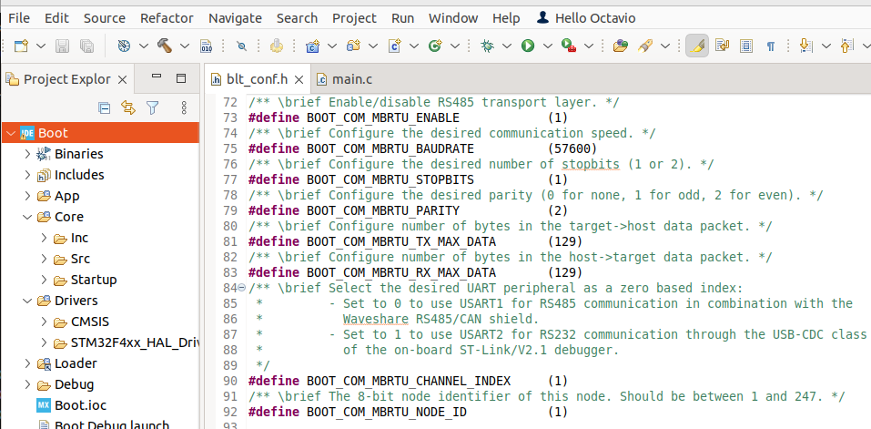
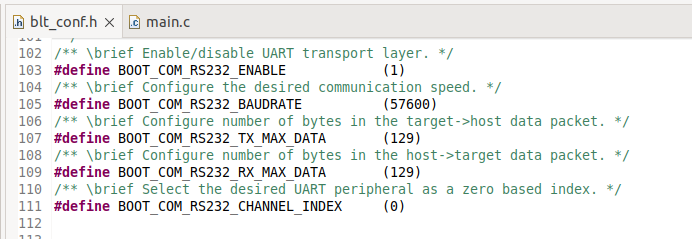
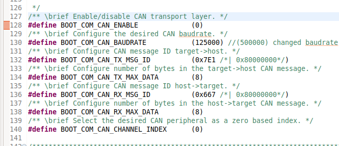
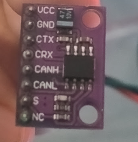
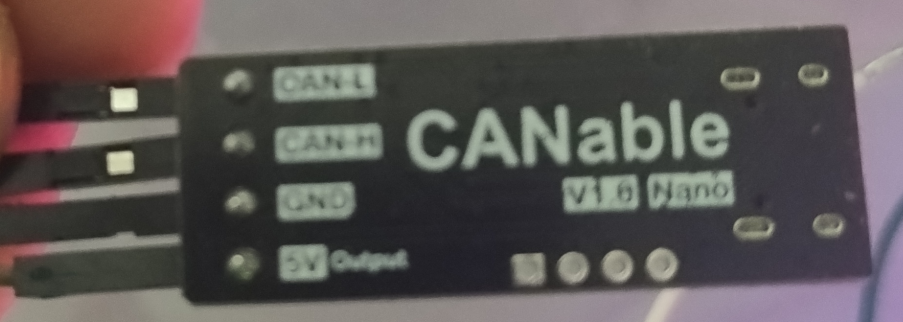
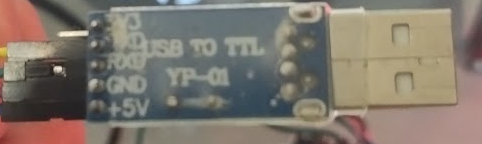
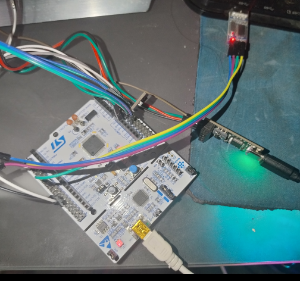
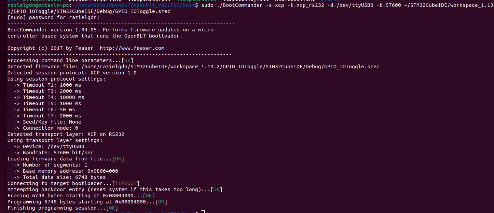

# Clone the Repository
To clone this repository, follow these steps:
 - Open a terminal or command prompt.   
 - Navigate to the directory where you want to clone the repository.
 - Run the following command:    
   `git clone  https://github.com/razielgdn/customNucleoF4-OpenBLT.git`
 - The main branch is **Nucleo-F446RE**

This project can be used with the Nucleo-F446RE board and can be ported to other boards with minimal changes.
- You can **import the project** to STM32CubeIDE with the [import tool](doc/importProject.md).
- After do it you can **build the system**, short instructions to do it can be founded [here](doc/BuildProject.md).

# OpenBLT use case
This project adds CAN and RS232 interfaces to [OpenBLT](https://www.feaser.com/openblt/doku.php?id=homepage) to **Nucleo STM32-F446RE**. The original demo in the OpenBLT project only supports Modbus RTU (**MBRTU**) interface. 

To use this repo you can follow the documentation from OpenBLT original project. You can activate or deactivate **MBRTU**, **RS232**, and **CAN** interfaces from the **blt_conf.h** file. 

RS232 and MBRTU are mutually exclusive by USART channel because both use the same ports. However, the CAN port can be used simultaneously with the others. The default project configuration is:
- MBRTU on.  
    

- RS232 on, using USART1 interface.   
    

- CAN off. 
     

# Build a demo
To do a quickly test of the function of this tool, you can get a Demo project in STM32cubeIDE. In this time the example [GPIO_IOToggle](doc/exampleimport.md) was used. To obtain a good function of this application the macro  VECT_TAB_OFFSET in system_stm32f4xx.c was modified to "0x4000" value. You can get more information in [rising embedded blog](https://razielgdn.github.io/risingembeddedmx/projects/en/openblt-start).

Once the demo is ready OpenBLT could be used to flash it. 

# Connect the Hardware

1. By default, the hardware to flash is configured as follows:
  - MBRTU is enabled on USART2. 
  - RS232 is enabled on USART1.
  - CAN bus is enabled on CAN1.
    > CAN requires the transceiver to be connected to work. If CAN_Rx and CAN_Tx are not connected, the system cannot be initialized.

2. Hardware interfaces:
  You can follow the schematics to connect the hardware.   
  - CAN: In this example a pair of devices was be used.   
    - CTJA1051 transceiver.   
        
    - CANable adapter.      
        
  - RS232: USB to TTL Converter.  
         

3. The connections should be:   
   | Resource  | GPIO | Board Connector    | Device           |  
   |-----------|------|--------------------|------------------|    
   | CAN1_RX   | PA11 | CN10 - Pin 14      | CTJA1051   - CRx |   
   | CAN1_TX   | PA12 | CN10 - Pin 12      | CTJA1051   - CTx |  
   | USART1_TX | PA9  | CN10 - Pin 21 (D8) | USB to TTL - Rx  |
   | USART1_RX | PA10 | CN10 - Pin 32 (D2) | USB to TTL - Tx  |   
   |           |      | CANable - CAN-H    | CTJA1051 - CANH  |
   |           |      | CANable - CAN-L    | CTJA1051 - CANL  |   

  The system working looks like:   
     

# Flash an application with OpenBLT
Following documentation you can use [BootCommander](https://www.feaser.com/openblt/doku.php?id=manual:bootcommander) and [Microboot](https://www.feaser.com/openblt/doku.php?id=manual:microboot)

> Bootcommander should be buid in the Host machine and it needs [LibOpenBLT](https://www.feaser.com/openblt/doku.php?id=manual:libopenblt), please check documentation to build it before build BootCommander. 

In linux systems (using a rapberrypi or a distro ) You can useBootCommander to flash the software. 

- Flash with MBRTU using usart2 with BootCommander using linux:   
  ` sudo ./BootCommander -s=xcp -t=xcp_mbrtu -d=/dev/ttyACM0 -b=57600 ~/STM32CubeIDE/workspace_1.13.2/GPIO_IOToggle/STM32CubeIDE/Debug/GPIO_IOToggle.srec `
- Flash with RS232 using a USB - TTL converter in linux:   
  `sudo ./BootCommander -s=xcp -t=xcp_rs232 -d=/dev/ttyUSB0 -b=57600 ~/STM32CubeIDE/workspace_1.13.2/GPIO_IOToggle/STM32CubeIDE/Debug/GPIO_IOToggle.srec `
- Fash with CAN using CANable in a linux system:
  1. Configure the Baudrate as **blt_conf.h** in the system.   
     `sudo ip link set can0 type can bitrate 125000`      
     `sudo ip link set up can0 `      
  2. Flash with BootCommander.   
     ` sudo ./BootCommander -s=xcp -t=xcp_can -d=can0 -b=125000 ~/STM32CubeIDE/workspace_1.13.2/GPIO_IOToggle/STM32CubeIDE/Debug/GPIO_IOToggle.srec `   
  3. You can se the output to check if it was successful:   
     

