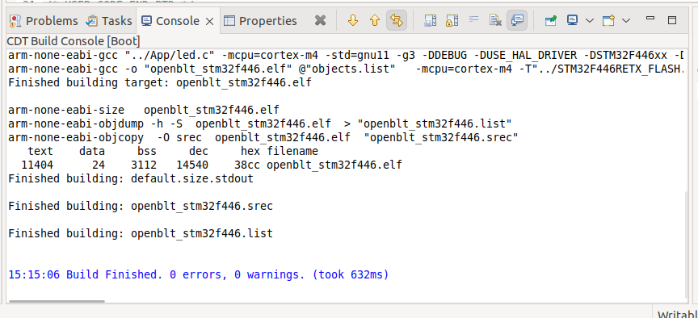
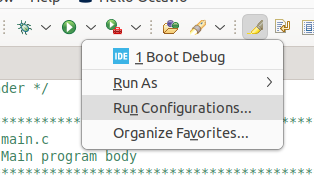
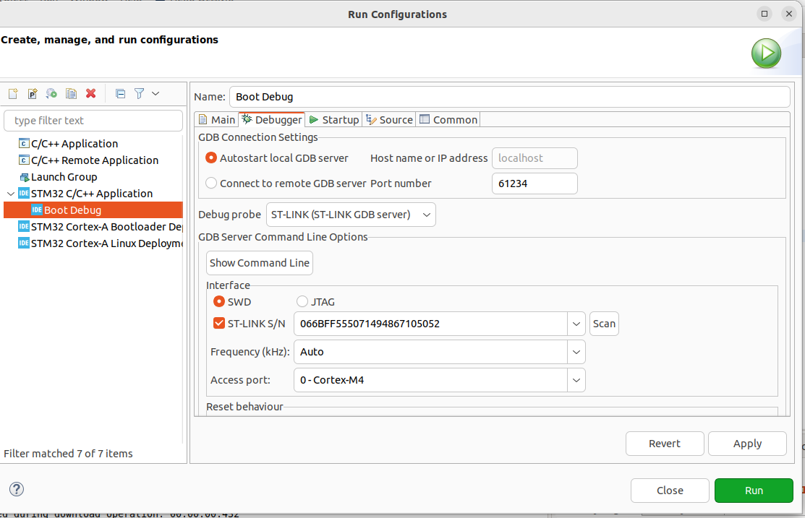

# Build an Run a project in STM32CubeIDE

The process to build a system is simple in an IDE.  
1. Right-clic on the main folder of the project.  
2. Click on the Build option.    
        
3. Check for errors and warnings in the output terminal.  
        
4. To run the application (flash it to the microcontroller on the board), click on the play icon.   
5. If you need to configure the STLink device, click on **Run Configurations...**   
     
6. In the left panel of the wizard, select **STM32 C/C++ Application**. Then, click on **Debugger** tab.      
7. In the Debug probe section, select **ST-LINK**. In the **Inteface** section, select **ST-LINK SN** and click on **Scan**.   
      
8. Click on **Run**.    
9. Your application should now run without issues. 
10. The configuration process is the same for the **Debug** option. 
