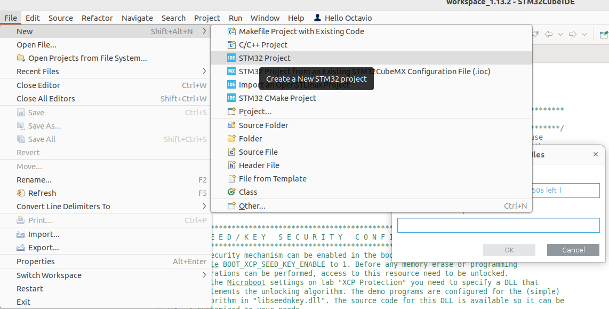
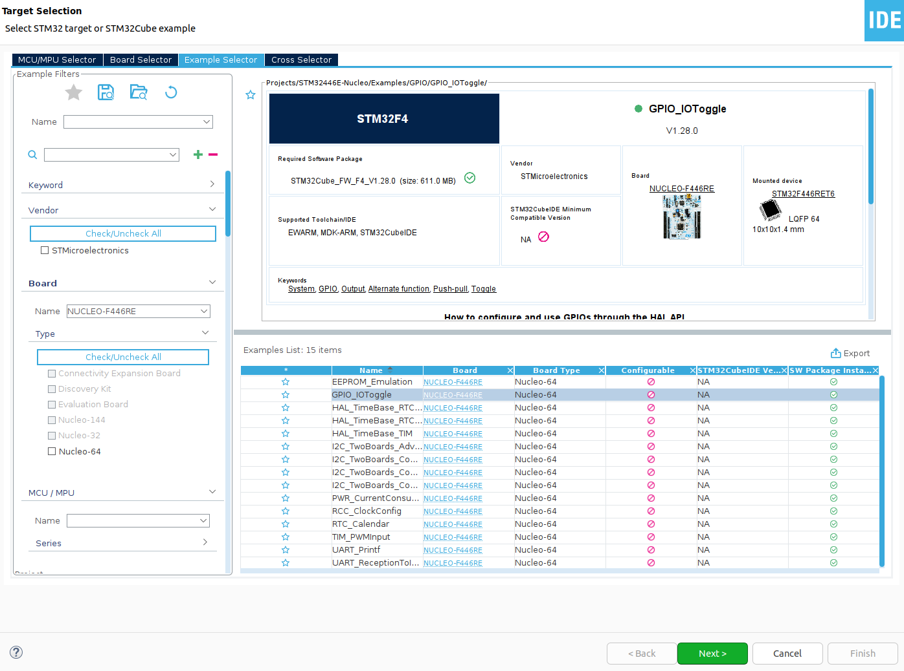
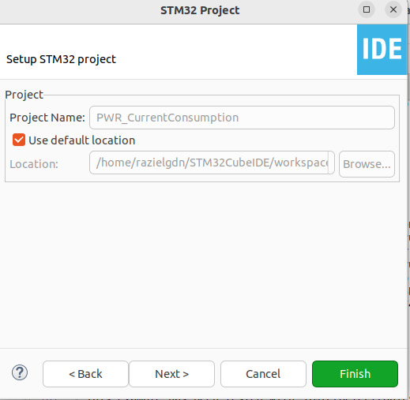

# Instructions to import a demo project from STMCube
Inside CubeIDE, go to the File menu.   
1. Clic on **File**>**New**>**STM 32 Project**.  
   
2. In the wizard, select  **Example Selector**.  
3. Find a board or a specific microcontroller. For this example, select the **NUCLEO-F446RE** board.    
4. In the examples list, select **GPIO_IOToggle**, and clic **Next**.   
  
5. Configure the location where the project will be stored. Clic **Finish** to complete the process.   
   
