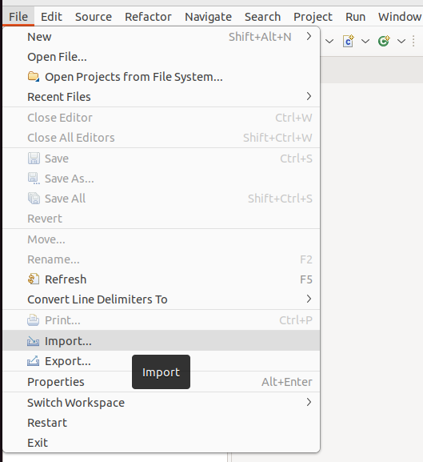
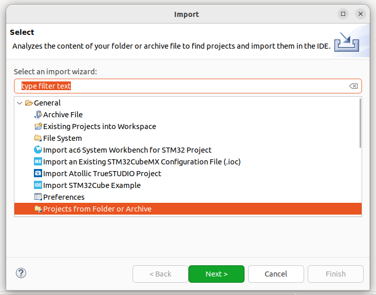

# How to import OpenBLT project to STM32 CubeIDE

Follow next steps to import the project to your workspace
  1. Get the sources 
  2. In STM32 CubeIDE go to File menu. 
  3. Select Import   
           
  4. In the wizard select in **Projects from folder or Archive**  and clic in **Next**
       
  5. Finally check the Folder that will be imported and clic **Finish**.